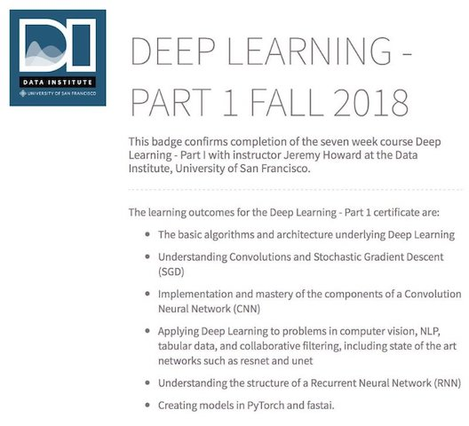

# DeepLearning-FastAI

1. [Car identification](https://github.com/XiwangLi/DeepLearning-FastAI/blob/master/Assigment/lesson2-car-identification.ipynb): transfer learning from Resnet for google image classification
2. [CNN image recognition model deployment](https://github.com/XiwangLi/DeepLearning-FastAI/blob/master/Assigment/Car_Net_XWL.ipynb): image recognition model traning and develoyment in https://carnet-xiwang.now.sh. Check my [medium blog](https://medium.com/@XiwangLi/convnets-my-carnet-google-image-classifier-3b464286c8d1)
3. [Kaggle Planet classification](https://github.com/XiwangLi/DeepLearning-FastAI/blob/master/Assigment/lesson3-planet_Xiwang.ipynb): ranked top 10% for Amazon planet label prediction
